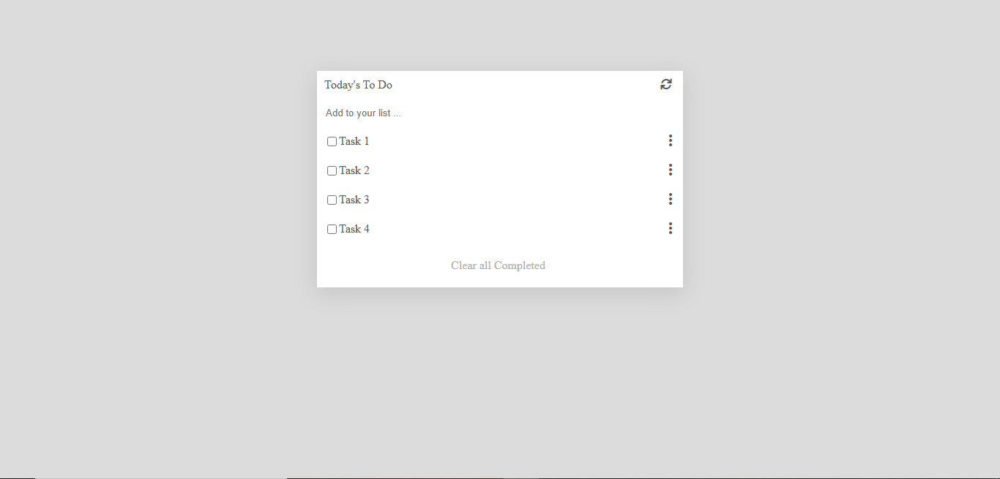

# ToDo List

> ToDo List JS Project.

## Built With

- Html
- JavaScript
- Css
- Webpack

## Live Demo

[Live Demo Link](https://keroloussamy.github.io/ToDo-list/dist/)

## Getting Started
To get a local copy up and running follow these simple example steps.

- Click on the top right green "code" button.
- On the dropdown menu, choose "download with zip" button.
- After download, extract the zip file and you have the project running on your machine.

## Authors

👤 **Kerolous Samy**

- GitHub: [@kerolous](https://github.com/keroloussamy)
- Twitter: [@kerolous](https://twitter.com/SamyKerolous)
- LinkedIn: [kerolous](https://www.linkedin.com/in/keroloussamy/)

## 🤝 Contributing

Contributions, issues, and feature requests are welcome!

Feel free to check the [issues page](../../issues/).

## Show your support

Give a ⭐️ if you like this project!

## 📝 License

This project is [MIT](./MIT.md) licensed.
